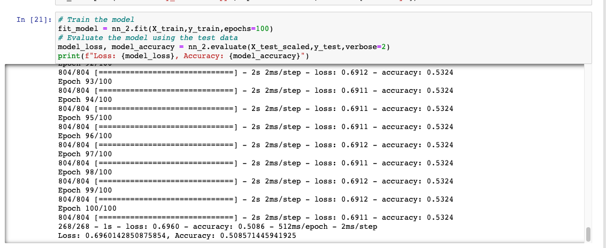

# Neural_Network_Charity_Analysis

## Overview of the analysis: 
In this project, we use neural networkd models is different with traditional statistical or machine learning model. We are working to develop a model to help Beks predict whether applicatnts will be successful if funded by Alphabet Soup.

## Results: 

### Data Preprocessing

What variable(s) are considered the target(s) for your model?
 - IS_SUCCESSFUL—Was the money used effectively
 
What variable(s) are considered to be the features for your model?
 - APPLICATION_TYPE—Alphabet Soup application type
 - AFFILIATION—Affiliated sector of industry
 - CLASSIFICATION—Government organization classification
 - USE_CASE—Use case for funding
 - ORGANIZATION—Organization type
 - STATUS—Active status
 - INCOME_AMT—Income classification
 - SPECIAL_CONSIDERATIONS—Special consideration for application
 - ASK_AMT—Funding amount requested
 
What variable(s) are neither targets nor features, and should be removed from the input data?
 - EIN and NAME—Identification columns

How many neurons, layers, and activation functions did you select for your neural network model, and why?
 - Attempt_1: Using original neuron, layers from Deliverable 1 neural newtwork model but change the bin size.
 - Attempt_2: Add third hidden layer
 - Attempt_3: Change the activation funcation to linear, relu and tanh
 
Were you able to achieve the target model performance?
 - original model
 
 
 - attempt_1 
 
 
 - attempt_2
 
 
 - attempt_3
 
 Comparate different target model performaces, the attempt models still not achieve the target.
 
What steps did you take to try and increase model performance?
- Attempt_1 : would like to change the bin size for APPCATION_TYPE and CLASSIFICATION from original neural model
- Attempt_2 : Try to add third hidden layer base on Attemp_1
- Attempt_3 : change the activation functions from Attempt_2

## Summary: 
From those Attempt test, we got a result was unable to adjust the model to reach 75% accuracy. And we still need to find out any other optimal linear regaression model or machine learning model to achieve 75% accuracy.